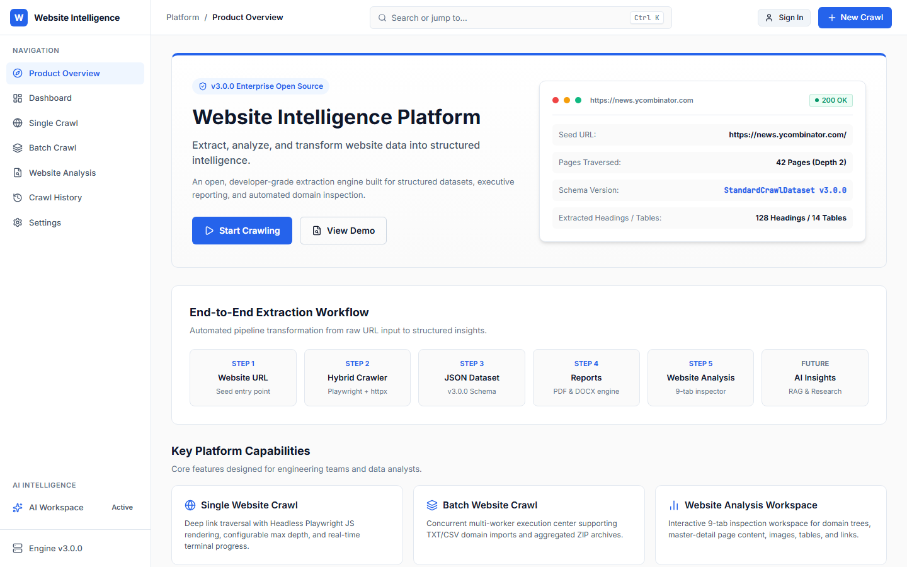
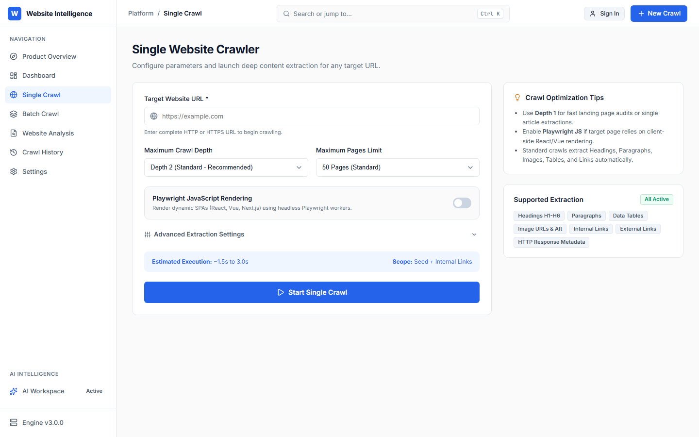
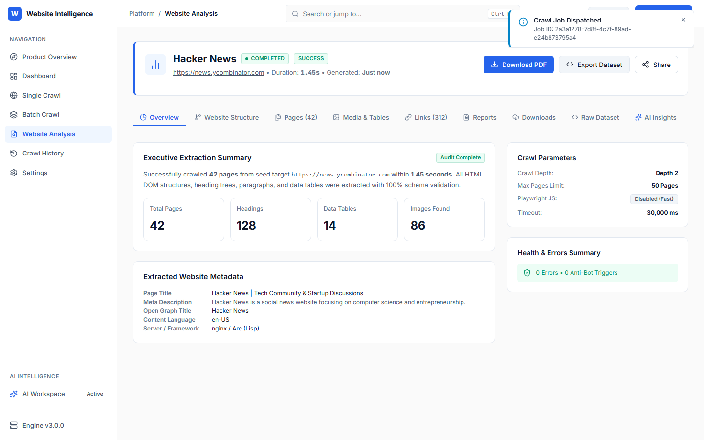
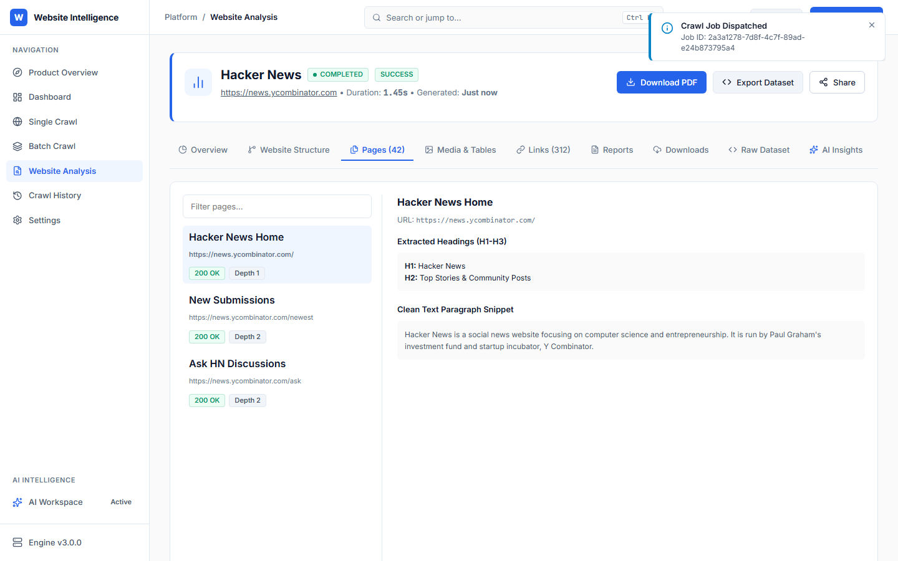
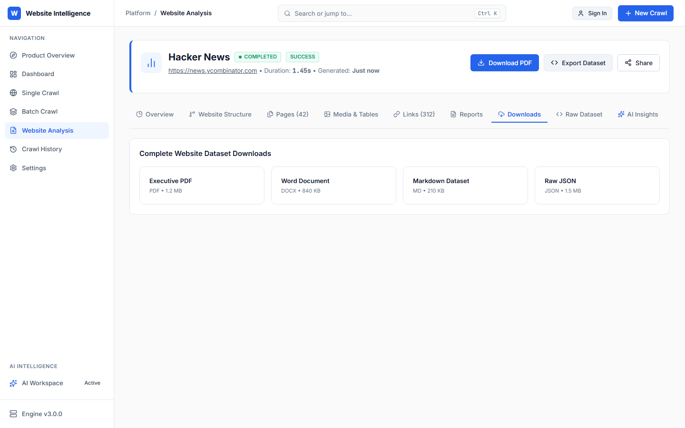
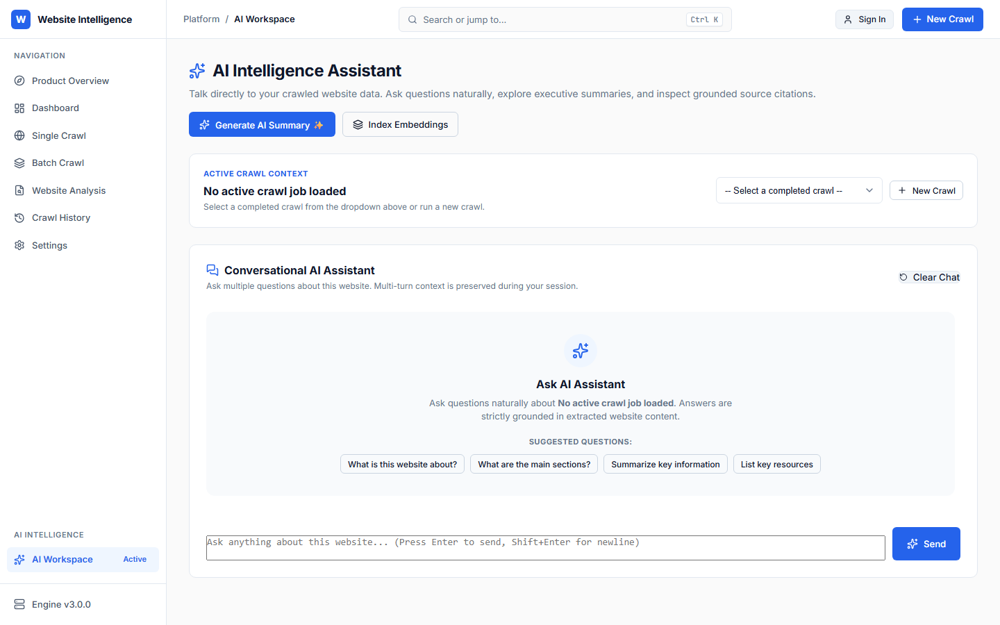
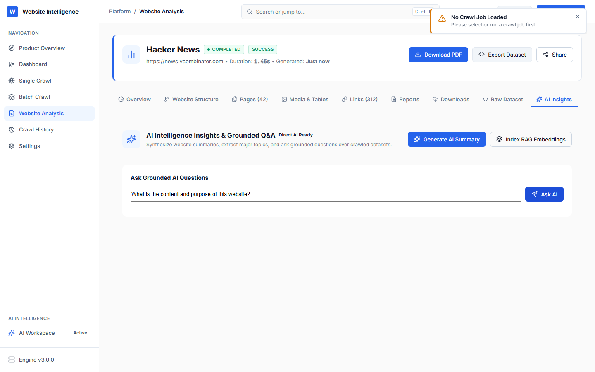
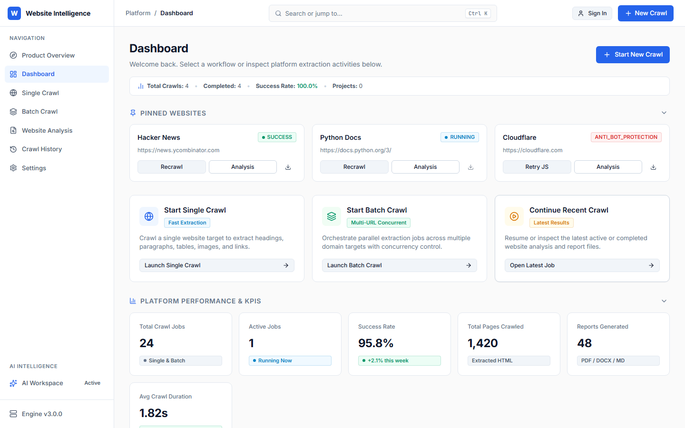

# Website Intelligence Platform

An enterprise-grade web data extraction, dataset analytics, and conversational AI platform. Automatically extract structured content from any website, generate multi-format dataset exports, and ask natural language questions grounded in your crawled data using RAG (Retrieval-Augmented Generation).

---

## Overview

Modern web data extraction requires more than raw HTML scraping—it requires converting unstructured web content into clean datasets, structural analytics, downloadable documents, and actionable intelligence.

The **Website Intelligence Platform** provides an end-to-end web data workspace:

```
Website URL → BFS Crawl → Content Extraction → Structural Analytics → Multi-Format Export → Grounded AI Assistant (Direct AI / RAG)
```

1. **Extraction**: Crawl single websites or batch domain lists with depth control, anti-bot handling, and optional Playwright headless JavaScript rendering.
2. **Analysis**: Extract headings, paragraphs, page link graphs, image assets, data tables, and metadata across every discovered URL.
3. **Export**: Stream complete datasets into 6 standard file formats (PDF, DOCX, Markdown, JSON, CSV, XLSX) on demand.
4. **Grounded AI**: Interact with your website dataset using Google Gemini AI. Automatically routes small datasets to Direct Context AI and large datasets to RAG (Retrieval-Augmented Generation) using 3072-dimensional `gemini-embedding-001` vector embeddings.

---

## Key Features

- **Single & Batch Web Crawling**: Breadth-First Search (BFS) link traversal with depth controls and URL normalization.
- **Comprehensive Extractor**: Automated extraction of page titles, headings (H1-H6), body paragraphs, image assets, internal/external link networks, and HTML data tables.
- **6 Export Formats**: Stream structured datasets into **PDF**, **DOCX**, **Markdown**, **JSON**, **CSV**, and **XLSX**.
- **AI Executive Summaries**: Produce automated structural reports and topic breakdowns for any crawl job.
- **Conversational Grounded Q&A**: Chat naturally with your web data; answers are strictly grounded in extracted content with clickable source page citations.
- **Intelligent Direct AI vs. RAG Routing**: Datasets under 30,000 tokens are processed via Direct AI Context; larger datasets automatically index semantic chunks into vector storage for RAG similarity retrieval.
- **High-Dimensional Vector Embeddings**: Uses Google Gemini `gemini-embedding-001` returning 3072-dimensional vector embeddings stored in database `DocumentChunk` entities.
- **Multi-Tenant Ownership & Isolation**: JWT authentication with user ownership boundaries across projects, crawl jobs, and vector storage.
- **Security & Free-Tier Guardrails**: Built-in SSRF protection, private IP blocking, sliding-window IP rate limiting (`60 req/min`), and configurable memory caps (`10MB` per page, `250` pages per crawl).
- **Responsive Dashboard UI**: Vanilla HTML5/CSS3/JavaScript SPA workspace featuring light/dark mode design, dataset search/filtering, and zero-overflow layout grids.

---

## Screenshots

Below are screenshots captured directly from the live platform:

### 1. Product Dashboard & Landing


### 2. Single Crawl Workspace


### 3. Website Analysis Overview


### 4. Website Structure & Pages Directory


### 5. Multi-Format Downloads & Exports


### 6. AI Intelligence Workspace


### 7. Grounded Conversational AI & RAG


### 8. User Authentication & Workspaces


---

## Architecture

The platform follows a layered, decoupled architecture ensuring clean separation of concerns, asynchronous processing, and dual-database compatibility.

```
[ Frontend SPA (HTML5/JS/CSS) ]
              │
              ▼
[ FastAPI Application Server ] ◄── Middleware (RateLimit, SecurityHeaders, Auth)
              │
              ├──► [ Crawl Service ] ──► [ BFS Crawler Engine ] ──► HTTPX / Playwright
              │
              ├──► [ Export Service ] ──► [ Exporter Registry ] ──► PDF/DOCX/MD/JSON/CSV/XLSX
              │
              └──► [ AI Service ]
                         │
        ┌────────────────┴────────────────┐
        ▼                                 ▼
  [ Direct AI Path ]               [ RAG Vector Path ]
  (Context < 30k tokens)           (Context > 30k tokens)
        │                                 │
        │                         ┌───────┴───────┐
        │                         ▼               ▼
        │                    [ Chunker ]  [ Gemini Embedding ] (3072-dim)
        │                         │               │
        │                         └───────┬───────┘
        │                                 ▼
        │                        [ Chunk Repository ] (Vector Search)
        │                                 │
        └────────────────┬────────────────┘
                         ▼
             [ Gemini 1.5 Flash LLM ]
                         │
                         ▼
             [ Grounded Q&A + Sources ]
```

### Database Abstraction
- **Development**: Zero-config local database via SQLite (`USE_SQLITE=True`).
- **Production**: Enterprise relational database via PostgreSQL (`USE_SQLITE=False` with `ASYNC_DATABASE_URI`).

---

## Technology Stack

| Category | Technology | Usage |
| :--- | :--- | :--- |
| **Frontend** | HTML5, Vanilla CSS3, JavaScript (ES6+) | Single-Page Application (SPA), zero build tools required |
| **Backend Framework** | FastAPI (Python 3.12) | Asynchronous REST API server & static asset mounting |
| **Database & ORM** | SQLAlchemy 2.0 (Async), Alembic | Async ORM models, relational schema migrations |
| **Crawler & Fetchers** | HTTPX, Playwright, BeautifulSoup4 | Asynchronous HTTP fetcher, headless JS renderer, HTML parser |
| **AI Generation** | Google Gemini API (`gemini-1.5-flash`) | Executive summarization & grounded Q&A text generation |
| **Vector Embeddings** | Google Gemini API (`gemini-embedding-001`) | 3072-dimensional float vector embeddings for RAG retrieval |
| **Export Engines** | ReportLab, python-docx, openpyxl, pandas | Server-side dynamic document streaming |
| **Testing** | pytest, pytest-asyncio, Playwright | Automated unit, integration, and browser smoke test suite |

---

## AI & RAG Engine

The platform integrates an intelligent RAG pipeline powered by Google Gemini:

1. **Dataset Sizing & Strategy Routing**:
   - `DIRECT_AI`: For small datasets ($< 30,000$ tokens and $\le 50$ pages), the full structured dataset context is injected directly into the LLM prompt.
   - `RAG`: For larger datasets ($> 30,000$ tokens or $> 50$ pages), the system performs semantic chunking ($1000$ chars, $150$ char overlap) and generates vector embeddings.
2. **Embedding Model**:
   - Uses `gemini-embedding-001` via Google Gemini v1beta API returning **3072-dimensional float vectors**.
3. **Vector Persistence & Idempotency**:
   - Embeddings are persisted in the `document_chunks` database table. Subsequent questions reuse existing vector embeddings without duplicate API calls.
4. **Similarity Search**:
   - Computes cosine similarity between question embeddings and stored document chunks (`top_k=5`) to retrieve relevant context blocks.
5. **Grounded Answers & Citations**:
   - All AI answers strictly cite source URLs and heading paths, preventing hallucination.

---

## Data & Database Schemas

The database schema manages users, projects, crawl jobs, extracted content, statistics, and vector chunks:

- `users`: User accounts and hashed authentication credentials.
- `projects`: Workspace containers for organizing crawl jobs.
- `crawl_jobs`: Crawl execution lifecycle, seed target URL, mode (`SINGLE` / `BATCH`), status (`PENDING`, `RUNNING`, `COMPLETED`, `FAILED`).
- `extracted_pages`: Normalized page content, headings, paragraphs, lists, tables, and response latency metrics.
- `page_links`: Discovered internal and external hyperlink graph.
- `page_images`: Image URLs and extracted alt-text metadata.
- `crawl_statistics`: Aggregated crawl timing, page counts, link totals, and error metrics.
- `document_chunks`: Semantic text chunks, heading paths, and 3072-dimensional vector embedding arrays.

---

## Export Formats

Datasets can be exported dynamically from any completed crawl workspace:

- **PDF**: Styled executive summary report with statistical metrics, page directory tables, and section headings.
- **DOCX**: Structured Microsoft Word document formatted for business reporting.
- **Markdown**: Clean Markdown document (`.md`) formatted with headings, bullet points, and source links.
- **JSON**: Comprehensive machine-readable JSON dataset export.
- **CSV**: Flat tabular CSV containing page-level extracted data.
- **XLSX**: Multi-sheet Microsoft Excel workbook containing separate sheets for *Pages*, *Links*, *Images*, and *Statistics*.

*Exports are generated on demand and streamed directly in the HTTP response body without persistent disk storage.*

---

## Security & Protection

- **SSRF Protection**: Validates all input target URLs against private IP address ranges (`127.0.0.1`, `10.0.0.0/8`, `172.16.0.0/12`, `192.168.0.0/16`, `localhost`) to prevent Server-Side Request Forgery.
- **Rate Limiting**: `RateLimitMiddleware` enforces sliding window IP rate limiting (`60 requests/minute`) on API endpoints.
- **OWASP Security Headers**: `SecurityHeadersMiddleware` injects `X-Frame-Options: DENY`, `X-Content-Type-Options: nosniff`, `Content-Security-Policy`, and `Strict-Transport-Security`.
- **Authorization Isolation**: API endpoints enforce project and crawl job ownership isolation per authenticated user.
- **Server-Side API Keys**: Third-party Gemini API keys remain strictly server-side and are never exposed in responses or client code.

---

## Free-Tier Resource Safeguards

To ensure safe operation on resource-constrained deployment environments (e.g. 512MB RAM free-tier instances), the platform enforces configurable server-side bounds:

| Parameter | Default Limit | Rationale |
| :--- | :--- | :--- |
| `MAX_SINGLE_CRAWL_PAGES` | **250 Pages** | Prevents RAM exhaustion during large link graph traversals |
| `MAX_BATCH_WEBSITES` | **25 Websites** | Prevents queue starvation in multi-site batch requests |
| `MAX_RESPONSE_SIZE_BYTES` | **10 MB** | Drops oversized remote payload downloads |
| `FETCH_TIMEOUT_SEC` | **15.0 Seconds** | Cancels hanging remote HTTP connections |
| `RATE_LIMIT_PER_MINUTE` | **60 Requests** | Protects API from automated spam |
| `ANONYMOUS_AI_DAILY_LIMIT` | **10 Queries/Day** | Controls third-party LLM costs for guest users |
| `AUTHENTICATED_AI_DAILY_LIMIT` | **100 Queries/Day** | Daily AI query quota for registered accounts |

---

## Local Development Setup

### Prerequisites
- Python 3.12+ installed
- Git

### Installation Steps

1. **Clone the repository**:
   ```bash
   git clone https://github.com/GANDLA-ARAVIND/universal-website-data-extractor.git
   cd universal-website-data-extractor
   ```

2. **Create and activate a virtual environment**:
   ```bash
   python -m venv venv
   # On Windows:
   venv\Scripts\activate
   # On macOS/Linux:
   source venv/bin/activate
   ```

3. **Install dependencies**:
   ```bash
   pip install -r requirements.txt
   ```

4. **Configure Environment Variables**:
   Copy `.env.example` to `.env` and fill in your Gemini API key:
   ```bash
   cp .env.example .env
   ```

5. **Initialize Database & Run Migrations**:
   ```bash
   alembic upgrade head
   ```

6. **Start the FastAPI Application Server**:
   ```bash
   uvicorn src.main:app --reload --host 127.0.0.1 --port 8000
   ```

7. **Access the Application**:
   Open your browser and navigate to:
   - Web Application UI: `http://127.0.0.1:8000/app`
   - Interactive OpenAPI Docs: `http://127.0.0.1:8000/docs`

---

## Environment Variables Configuration

| Variable | Default | Description |
| :--- | :--- | :--- |
| `PROJECT_NAME` | `"Universal Website Data Extractor"` | Application title displayed in API docs |
| `USE_SQLITE` | `true` | Set `true` for local SQLite development; `false` for PostgreSQL |
| `SQLITE_DB_PATH` | `"./web_scraper.db"` | Local SQLite database file location |
| `POSTGRES_SERVER` | `"localhost"` | PostgreSQL server hostname (when `USE_SQLITE=false`) |
| `POSTGRES_PORT` | `5432` | PostgreSQL server port |
| `POSTGRES_USER` | `"postgres"` | Database username |
| `POSTGRES_PASSWORD` | `"postgres_password"` | Database password |
| `POSTGRES_DB` | `"web_scraper_db"` | Database name |
| `DEFAULT_MAX_DEPTH` | `2` | Default crawl link depth limit |
| `DEFAULT_MAX_PAGES` | `50` | Default page extraction limit |
| `FETCH_TIMEOUT_SEC` | `15.0` | HTTP fetch timeout in seconds |
| `MAX_SINGLE_CRAWL_PAGES` | `250` | Upper limit cap for single crawl requests |
| `MAX_BATCH_WEBSITES` | `25` | Upper limit cap for batch website count |
| `MAX_RESPONSE_SIZE_BYTES` | `10485760` | Max page download size (10MB) |
| `GEMINI_API_KEY` | `""` | Google Gemini API Key |
| `GEMINI_MODEL` | `"gemini-flash-latest"` | Text generation model name |
| `EMBEDDING_MODEL` | `"gemini-embedding-001"` | Vector embedding model (3072 dimensions) |
| `ALLOW_AI_MOCK_FALLBACK` | `false` | Fallback mock responses when key is omitted |

---

## API Endpoints Reference

The platform provides a REST API documented via Swagger OpenAPI (`/docs`):

### Authentication & Users
- `POST /api/v1/auth/register` — Register a new account
- `POST /api/v1/auth/token` — Authenticate and receive JWT OAuth2 access token
- `GET /api/v1/auth/me` — Retrieve current authenticated user profile

### Single & Batch Crawling
- `POST /api/v1/crawl` — Initiate a single website crawl job
- `GET /api/v1/crawl/jobs` — List crawl jobs with pagination and filters
- `GET /api/v1/crawl/{job_id}` — Get crawl job status and execution progress
- `GET /api/v1/crawl/{job_id}/results` — Get extracted pages and dataset content
- `POST /api/v1/batch` — Initiate a multi-website batch crawl

### AI & RAG Intelligence
- `POST /api/v1/ai/crawl/{job_id}/analyze` — Generate executive summary and topic breakdown
- `POST /api/v1/ai/crawl/{job_id}/query` — Ask grounded Q&A question over dataset
- `POST /api/v1/ai/crawl/{job_id}/prepare-rag` — Pre-index RAG vector embeddings

### Multi-Format Exports
- `POST /api/v1/crawl/{job_id}/export/{format}` — Download crawl dataset (`pdf`, `docx`, `markdown`, `json`, `csv`, `xlsx`)
- `POST /api/v1/batch/{batch_id}/export/{format}` — Download batch dataset export

---

## Testing & Quality Assurance

The repository includes a comprehensive automated test suite built with `pytest`:

```bash
# Run all unit and integration tests:
pytest -v
```

### Verified Test Suite Summary
- **Total Passing Tests**: **58 / 58 PASSED**
- **Test Categories**:
  - `tests/integration/test_ai_rag_flow.py`: RAG indexing, 3072-dim embeddings, vector retrieval, grounded Q&A.
  - `tests/integration/test_crawl_api.py`: Crawl execution lifecycle, dataset pagination, and filters.
  - `tests/integration/test_batch_api.py`: Multi-website batch processing and concurrency.
  - `tests/unit/test_ai_foundation.py`: Gemini provider, embedding dimension consistency, mock generators.
  - `tests/unit/test_ssrf_protection.py`: SSRF validation, private IP blocking, URL normalization.
  - `tests/unit/test_api_validation.py`: Pydantic request schema upper bounds and validation.
  - `tests/unit/test_security_headers.py`: OWASP HTTP headers and rate limit middleware.

---

## Project Directory Structure

```
universal-website-data-extractor/
├── alembic/                      # Alembic database migration scripts
│   └── versions/                 # DB migration files
├── docs/                         # Documentation and screenshots
│   └── screenshots/              # Captured application UI screenshots
├── src/                          # Application source code
│   ├── api/                      # FastAPI endpoints and route handlers
│   │   └── v1/                   # REST API v1 endpoints
│   ├── application/              # Service/use-case business logic
│   │   └── services/             # Crawl, Batch, Export, Auth, AI services
│   ├── core/                     # Core settings, security, logging, middleware
│   ├── crawler/                  # BFS crawler engine, fetchers, HTML parser
│   ├── db/                       # Database models, session, repositories
│   └── schemas/                  # Pydantic request & response schemas
├── static/                       # Frontend SPA static assets
│   ├── index.html                # Single-Page Application HTML
│   ├── app.js                    # SPA application state and API client
│   └── styles.css                # CSS design system & layout styles
├── tests/                        # Automated unit and integration test suite
│   ├── integration/              # API flow and RAG integration tests
│   └── unit/                     # Isolation unit tests
├── .env.example                  # Environment configuration template
├── alembic.ini                   # Alembic configuration
├── pyproject.toml                # Python project configuration
├── README.md                     # Project documentation
└── requirements.txt              # Python package dependencies
```

---

## Production Deployment Preparation

To deploy the application to cloud platforms (e.g. Render, Railway, AWS, DigitalOcean):

1. **Database Configuration**:
   Set `USE_SQLITE=false` and configure PostgreSQL environment variables:
   ```env
   USE_SQLITE=false
   POSTGRES_SERVER="your-db-host.postgres.database.azure.com"
   POSTGRES_PORT=5432
   POSTGRES_USER="db_admin"
   POSTGRES_PASSWORD="secure_password"
   POSTGRES_DB="website_intelligence_db"
   ```
2. **Apply Migrations**:
   Run database migrations during deployment startup:
   ```bash
   alembic upgrade head
   ```
3. **Start Application Server**:
   Start Uvicorn with production binding:
   ```bash
   uvicorn src.main:app --host 0.0.0.0 --port $PORT
   ```

---

## Limitations

- **Anti-Bot Protections**: Websites protected by aggressive anti-bot services (e.g. Cloudflare Turnstile, Akamai) require JavaScript rendering (`render_js=True`).
- **Playwright Headless Memory**: Running multiple concurrent Playwright headless browser instances increases RAM consumption.
- **Gemini Rate Limits**: Free-tier Gemini API keys have lower requests-per-minute limits. The system handles rate limits gracefully with HTTP 429 status codes.

---

## Future Roadmap

- [ ] **Multi-Agent Research Workflows**: Autonomous multi-agent deep research capabilities across extracted web datasets.
- [ ] **Scheduled Recrawls**: Cron-scheduled recrawling for website change detection.
- [ ] **Native Vector Database Integration**: Support for external vector databases (pgvector, Qdrant) alongside ORM storage.
- [ ] **Webhook Notifications**: Webhook integration for completed crawl and batch job alerts.

---

## License

Licensing terms should be determined separately prior to commercial distribution.

---

## Author & Repository Links

- **Repository**: [GANDLA-ARAVIND/universal-website-data-extractor](https://github.com/GANDLA-ARAVIND/universal-website-data-extractor)
