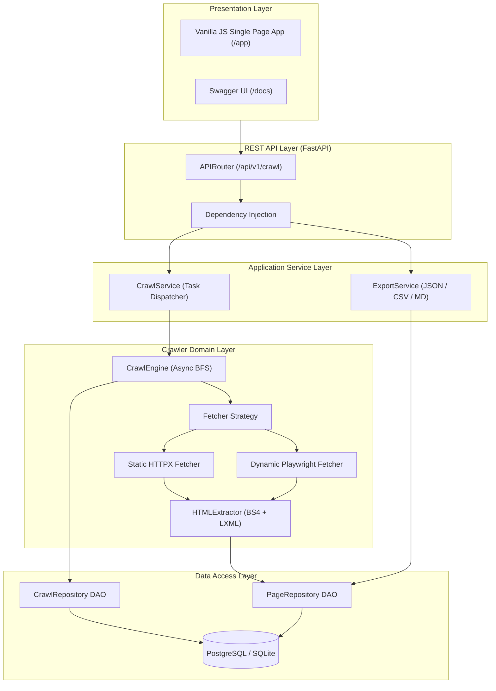
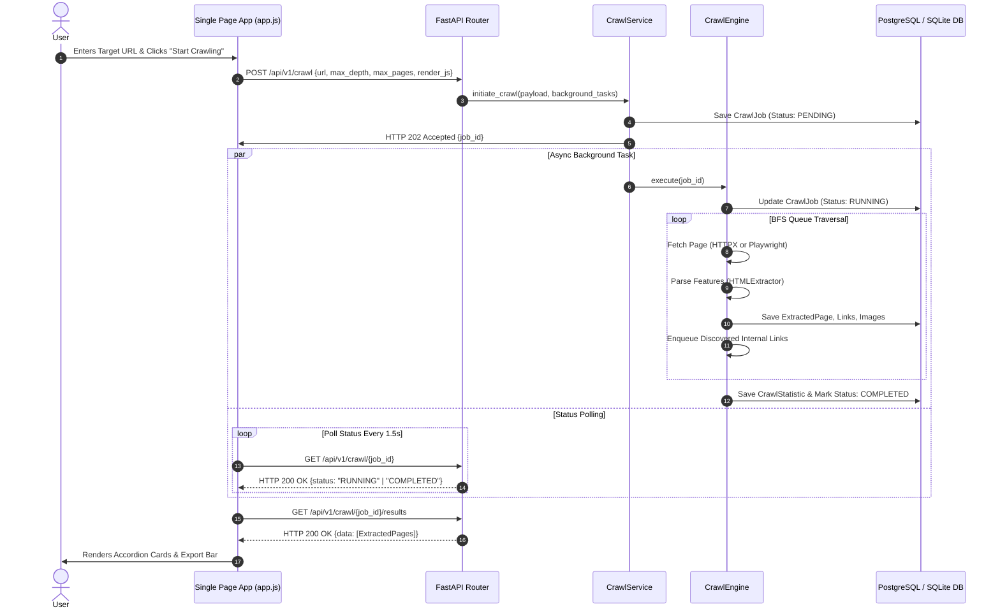
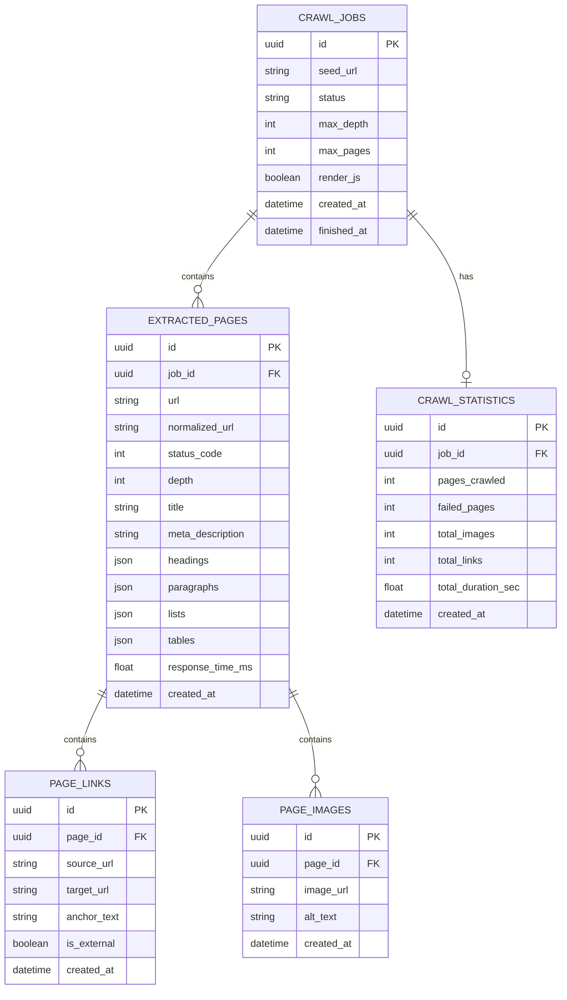

# Universal Website Data Extractor

[](https://www.python.org/)
[](https://fastapi.tiangolo.com/)
[](https://www.sqlalchemy.org/)
[](https://playwright.dev/python/)
[](LICENSE)

An asynchronous web crawling and structural data extraction engine built with **Python**, **FastAPI**, **Playwright**, **BeautifulSoup4**, **SQLAlchemy 2.0 Async**, **PostgreSQL**, and a zero-framework **Vanilla JavaScript SPA**.

---

## Executive Overview

The **Universal Website Data Extractor** is a full-stack web scraping platform engineered to traverse web domains, render static and dynamic Single Page Applications (SPAs), extract structural page data (headings, paragraphs, lists, tables, media, internal/external links), and persist datasets into relational storage for multi-format export (**JSON**, **CSV**, **Markdown**).

Built following **Clean Architecture** and **SOLID principles**, the system decouples API request handling, background task orchestration, crawler strategies, feature parsing, and data persistence into distinct, independently testable modules.

---

## Implemented Features

### 1. Domain-Isolated Asynchronous Crawler
- **HTTP/HTTPS Validation**: Enforces public web scheme checks preventing SSRF or unsupported protocols.
- **Domain Scoping**: Traverses only links belonging to the seed URL's domain.
### 1. Multi-Website Batch Crawling Engine
- **Single & Batch Crawling Modes**: Crawl individual websites or multi-website batches concurrently.
- **CSV & Text File Import**: Parse and validate seed URLs from multi-line text input or uploaded CSV files.
- **Bounded Concurrency Control**: Configurable `MAX_CONCURRENT_BATCH_JOBS` via `.env` (default: 3) utilizing `asyncio.Semaphore` to manage system load.
- **Resilient Failure Isolation**: Failed websites are isolated without crashing the batch.
- **Selective Batch Retry**: Re-trigger background crawling specifically for failed websites without re-crawling completed sites.

### 2. Autonomous Web Fetcher & Extractor
- **Hybrid Fetch Engine**: Blazing fast async HTTP requests (`httpx`) paired with headless Chromium rendering (`playwright`) for JavaScript SPAs.
- **Structured Content Extraction**: Extracts page titles, meta descriptions, heading hierarchy (`H1`–`H6`), paragraph text blocks, HTML data tables, unordered/ordered lists, hyperlinks, and image assets.
- **Domain Scope Enforcement**: Enforces domain-level BFS boundaries to prevent accidental external link traversal.

### 3. Relational Persistence & Exporters
- **SQLAlchemy 2.0 Async ORM**: Non-blocking database I/O (`asyncpg` for PostgreSQL, `aiosqlite` for zero-config local dev).
- **Multi-Format Exports**: Downloads single or multi-website datasets on-demand in **JSON**, **CSV**, **Markdown** (`.md`), **PDF** (`.pdf`), **Microsoft Word** (`.docx`), and **Microsoft Excel** (`.xlsx`).

### 5. SaaS Single Page Interface (`/app`)
- **Live Activity Console**: Auto-scrolling real-time log tracking crawl milestones.
- **Website Preview**: Dynamic favicon, title, and description resolution via Google Favicon API.
- **Client-Side Search & Filter**: Real-time searching and dynamic sorting (*URL*, *Title*, *Response Time*, *Links*, *Images*).
- **Sticky Navigation**: Smooth jump scrolling across dashboard sections.

---

## Screenshots

> *Placeholders: Replace image URLs after capturing dashboard screenshots.*

| Home Page & Configuration | Live Crawl Progress & Console |
| :---: | :---: |
| `` | `` |

| Extracted Results & Accordions | Data Export Section |
| :---: | :---: |
| `` | `` |

---

## System Architecture

The application is structured into four Clean Architecture layers:



### End-to-End Crawl Flow Sequence



---

## Directory Structure

```
e:/web-scraper/
├── .env                        # Local Environment Variables
├── .env.example                # Template Environment File
├── .gitignore                  # Git Exclusion Definitions
├── pyproject.toml              # Project Build Metadata & Dependencies
├── README.md                   # Project Documentation
├── static/                     # Frontend Static Single Page Application
│   ├── index.html              # SPA HTML Layout
│   ├── styles.css              # Custom SaaS CSS System
│   └── app.js                  # Asynchronous Vanilla JS Controller
├── src/                        # Backend Application Source Code
│   ├── main.py                 # FastAPI Factory & Exception Handler
│   ├── api/                    # API Controllers & Dependencies
│   │   ├── dependencies.py     # FastAPI Service Injectors
│   │   └── v1/
│   │       ├── router.py       # V1 Router Aggregator
│   │       └── endpoints/
│   │           └── crawl.py    # REST Routes (/api/v1/crawl)
│   ├── application/            # Business Logic Services
│   │   └── services/
│   │       ├── crawl_service.py# Job Orchestration
│   │       └── export_service.py# Multi-Format Exporters
│   ├── core/                   # Configuration & Logging
│   │   ├── config.py           # Pydantic BaseSettings
│   │   ├── exceptions.py       # Custom Domain Exceptions
│   │   └── logging.py          # Structured Logger Setup
│   ├── crawler/                # Crawler Engine & Parsers
│   │   ├── engine.py           # Async BFS Traversal Loop
│   │   ├── fetchers/           # Strategy Pattern Fetchers
│   │   └── extractors/         # BS4 HTML Parser
│   ├── db/                     # Data Access & ORM Models
│   │   ├── base.py             # Declarative Base Class
│   │   ├── session.py          # Async Engine & Session Factory
│   │   ├── models/             # SQLAlchemy Entities
│   │   └── repositories/       # Repository DAOs
│   ├── schemas/                # Pydantic Request/Response Schemas
│   └── utils/                  # URL Utilities & Normalization
└── tests/                      # Automated Test Suite
    ├── conftest.py             # Pytest Async Fixtures & SQLite Engine
    ├── integration/            # API Route Tests
    └── unit/                   # Extractor & Utility Tests
```

---

## Tech Stack

- **Language**: Python 3.11+
- **Backend Framework**: FastAPI (ASGI)
- **Web Scraping Engines**: BeautifulSoup4, LXML, Playwright (Headless Chromium), HTTPX
- **Async I/O**: `asyncio`
- **Database & ORM**: PostgreSQL, SQLite (`aiosqlite`), SQLAlchemy 2.0 (Async)
- **Validation & Settings**: Pydantic V2, `pydantic-settings`
- **Frontend**: HTML5, CSS3, ES6+ Vanilla JavaScript (No external frameworks)
- **Testing**: Pytest, `pytest-asyncio`, `httpx`

---

## Installation & Local Setup

### Prerequisites
- Python 3.11 or higher
- Git

### 1. Clone & Environment Setup
```bash
# Clone the repository
git clone https://github.com/your-username/web-scraper.git
cd web-scraper

# Create and activate virtual environment
python -m venv .venv
# On Windows:
.venv\Scripts\activate
# On Linux/macOS:
source .venv/bin/activate
```

### 2. Dependency Installation
```bash
# Install package dependencies
pip install -e .[dev]

# Install Playwright browser binaries
playwright install chromium
```

### 3. Environment Variable Configuration
Copy `.env.example` to `.env`:

```bash
# Set USE_SQLITE=true for zero-config local development without PostgreSQL
USE_SQLITE=true
SQLITE_DB_PATH="./web_scraper.db"

# PostgreSQL Credentials (used if USE_SQLITE=false)
POSTGRES_SERVER="localhost"
POSTGRES_PORT=5432
POSTGRES_USER="postgres"
POSTGRES_PASSWORD="your_password"
POSTGRES_DB="web_scraper_db"
```

### 4. Run the Server
```bash
uvicorn src.main:app --reload --host 0.0.0.0 --port 8000
```

Access Points:
- 🖥️ **Web Dashboard**: [http://localhost:8000/app](http://localhost:8000/app)
- 📖 **Swagger UI Docs**: [http://localhost:8000/docs](http://localhost:8000/docs)

---

## Environment Variables Specification

| Variable | Type | Default | Description |
| :--- | :--- | :--- | :--- |
| `PROJECT_NAME` | string | `Universal Website Data Extractor` | Application title used in OpenAPI docs. |
| `VERSION` | string | `0.1.0` | Current software release version. |
| `DEBUG` | boolean | `true` | Enables detailed logging and SQL statement echo. |
| `API_V1_STR` | string | `/api/v1` | Base API route prefix. |
| `USE_SQLITE` | boolean | `true` | When `true`, uses SQLite database (`sqlite+aiosqlite`). |
| `SQLITE_DB_PATH` | string | `./web_scraper.db` | Relative file path for SQLite database. |
| `POSTGRES_SERVER` | string | `localhost` | PostgreSQL host. |
| `POSTGRES_PORT` | integer | `5432` | PostgreSQL port. |
| `POSTGRES_USER` | string | `postgres` | PostgreSQL username. |
| `POSTGRES_PASSWORD` | string | `postgres_password` | PostgreSQL password. |
| `POSTGRES_DB` | string | `web_scraper_db` | PostgreSQL database name. |
| `DEFAULT_MAX_DEPTH` | integer | `2` | Fallback crawl depth limit. |
| `DEFAULT_MAX_PAGES` | integer | `50` | Fallback total page count limit. |
| `DEFAULT_CRAWL_DELAY_SEC` | float | `0.5` | Delay in seconds between HTTP requests. |
| `FETCH_TIMEOUT_SEC` | float | `15.0` | HTTP request timeout in seconds. |

---

## REST API Reference

### 1. Initiate Crawl Job
`POST /api/v1/crawl` (HTTP 202 Accepted)

#### Request Body
```json
{
  "url": "https://news.ycombinator.com",
  "max_depth": 2,
  "max_pages": 20,
  "render_js": false
}
```

#### Response (HTTP 202 Accepted)
```json
{
  "id": "a1b2c3d4-e5f6-7890-abcd-ef1234567890",
  "seed_url": "https://news.ycombinator.com/",
  "status": "RUNNING",
  "max_depth": 2,
  "max_pages": 20,
  "render_js": false,
  "created_at": "2026-08-05T10:00:00Z",
  "finished_at": null
}
```

---

### 2. Get Crawl Status
`GET /api/v1/crawl/{job_id}` (HTTP 200 OK)

#### Response
```json
{
  "id": "a1b2c3d4-e5f6-7890-abcd-ef1234567890",
  "seed_url": "https://news.ycombinator.com/",
  "status": "COMPLETED",
  "max_depth": 2,
  "max_pages": 20,
  "render_js": false,
  "created_at": "2026-08-05T10:00:00Z",
  "finished_at": "2026-08-05T10:00:14Z"
}
```

---

### 3. Get Extracted Results
`GET /api/v1/crawl/{job_id}/results?page=1&limit=20` (HTTP 200 OK)

#### Response
```json
{
  "total": 1,
  "page": 1,
  "limit": 20,
  "data": [
    {
      "id": "f8e7d6c5-b4a3-2109-8765-43210fedcba9",
      "job_id": "a1b2c3d4-e5f6-7890-abcd-ef1234567890",
      "url": "https://news.ycombinator.com/",
      "normalized_url": "https://news.ycombinator.com/",
      "status_code": 200,
      "depth": 0,
      "title": "Hacker News",
      "meta_description": null,
      "headings": { "h1": ["Hacker News"] },
      "paragraphs": [],
      "lists": [],
      "tables": [],
      "response_time_ms": 115.4,
      "created_at": "2026-08-05T10:00:02Z",
      "links_count": 45,
      "images_count": 2
    }
  ]
}
```

---

### 4. Get Statistics
`GET /api/v1/crawl/{job_id}/statistics` (HTTP 200 OK)

#### Response
```json
{
  "job_id": "a1b2c3d4-e5f6-7890-abcd-ef1234567890",
  "pages_crawled": 1,
  "failed_pages": 0,
  "total_images": 2,
  "total_links": 45,
  "total_duration_sec": 14.8
}
```

---

### 5. Export Dataset
`POST /api/v1/crawl/{job_id}/export` (HTTP 200 OK)

#### Request Body
```json
{
  "format": "json"
}
```
*Supports `"json"`, `"csv"`, or `"markdown"`.*

#### Response
Binary stream attachment with header `Content-Disposition: attachment; filename="crawl_export_{job_id}.json"`.

---

## Database Overview

### Entity Relationship Diagram



---

## Export Formats

- **JSON**: Fully structured export containing nested headers, paragraphs, lists, tables, links, images, and performance latencies.
- **CSV**: Flat tabular structure containing `URL`, `Normalized URL`, `Status Code`, `Depth`, `Title`, `Meta Description`, `Links Count`, `Images Count`, `Response Time`, and `Timestamp`.
- **Markdown**: Formatted document containing page headings (`#`, `##`), quotes (`>`), bullet lists, and image markdown (``).

---

## Key Design Decisions & Trade-offs

1. **FastAPI & AsyncIO**: Selected for non-blocking concurrency, allowing background HTTP fetching and DB operations without thread contention.
2. **Strategy Pattern for Fetchers**: Decouples lightweight static fetching (`HTTPX`) from heavy browser rendering (`Playwright`), ensuring high throughput for static web pages.
3. **Pydantic V2 Validation**: Guarantees boundary input validation before executing network I/O.
4. **SQLAlchemy 2.0 Async ORM**: Provides type-safe database queries while supporting both PostgreSQL (`asyncpg`) and SQLite (`aiosqlite`).

---

## Solved Engineering Challenges

- **URL Canonicalization & Deduplication**: Resolved duplicate link crawling by normalizing schemes, stripping fragments (`#anchor`), sorting query parameters, and normalizing trailing slashes.
- **Async Database Connection Scoping**: Background crawler tasks run in dedicated isolated database session contexts to prevent closed loop session errors.

---

## Known MVP Limitations

- **Single-Node Execution**: Background tasks run within FastAPI `BackgroundTasks` in-process rather than a distributed queue.
- **Unauthenticated Access**: API endpoints are public for MVP testing.
- **In-Memory URL Queue**: URL frontier queue is stored in memory per job rather than a distributed Redis queue.

---

## Future Enhancements

- Distributed task queue using **Celery** & **Redis**.
- **JWT Authentication** and user management.
- **Docker** & **Docker Compose** containerization.
- **Sitemap.xml** and **Robots.txt** automated discovery.

---

## License

This project is licensed under the [MIT License](LICENSE).
