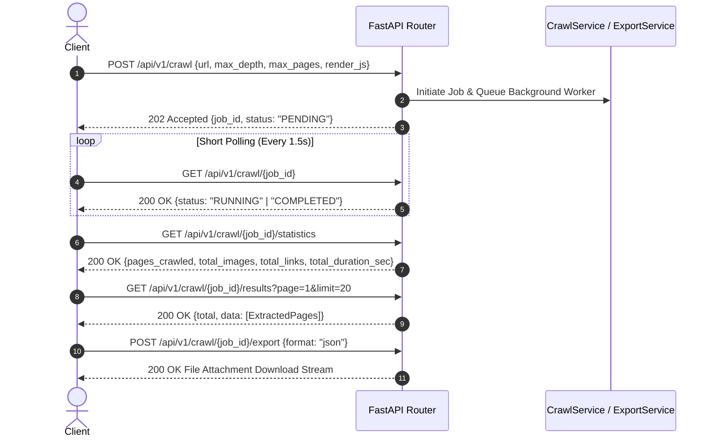

# Universal Website Data Extractor - REST API Documentation

This document provides complete, technically accurate documentation for all REST API endpoints implemented in the **Universal Website Data Extractor**.

- **Base URL**: `http://localhost:8000/api/v1`
- **Content-Type**: `application/json`
- **Interactive OpenAPI Specification**: `http://localhost:8000/docs`

---

## Standard Error Response Structure

Domain-specific errors return a standardized JSON error response:

```json
{
  "detail": "Descriptive error message explaining the failure cause.",
  "type": "ExceptionClassName"
}
```

### HTTP Status Code Mapping

| Status Code | Reason | Description |
| :--- | :--- | :--- |
| `200 OK` | Success | Request succeeded and returned requested resources or file stream. |
| `202 Accepted` | Accepted | Crawl job successfully initiated and queued for background execution. |
| `400 Bad Request` | Validation / Domain Error | Invalid URL scheme or export formatting error. |
| `404 Not Found` | Not Found | Requested `job_id` does not exist in persistent database storage. |
| `422 Unprocessable Entity` | Schema Error | Pydantic data validation failed for query/path/body schema parameters. |
| `500 Internal Server Error` | Unexpected Failure | System error during execution. |

---

## 1. Initiate Web Crawl Job

Accepts a target website URL and configuration parameters to initiate an asynchronous web crawl in the background.

- **URL**: `/crawl`
- **HTTP Method**: `POST`
- **Status Code**: `202 Accepted`

### Request Body Schema

```json
{
  "url": "string (Required, HTTP/HTTPS URL)",
  "max_depth": "integer (Optional, range: 0-10, default: 2)",
  "max_pages": "integer (Optional, range: 1-1000, default: 50)",
  "render_js": "boolean (Optional, default: false)"
}
```

### Response Schema (202 Accepted)

```json
{
  "id": "uuid",
  "seed_url": "string",
  "status": "PENDING | RUNNING",
  "max_depth": 2,
  "max_pages": 50,
  "render_js": false,
  "created_at": "datetime (ISO-8601)",
  "finished_at": null
}
```

### Example Request (cURL)

```bash
curl -X 'POST' \
  'http://localhost:8000/api/v1/crawl' \
  -H 'Content-Type: application/json' \
  -d '{
  "url": "https://news.ycombinator.com",
  "max_depth": 2,
  "max_pages": 20,
  "render_js": false
}'
```

### Example Response (202 Accepted)

```json
{
  "id": "9b1deb4d-3b7d-4bad-9bdd-2b0d7b3dcb6d",
  "seed_url": "https://news.ycombinator.com/",
  "status": "PENDING",
  "max_depth": 2,
  "max_pages": 20,
  "render_js": false,
  "created_at": "2026-08-05T10:00:00.000000Z",
  "finished_at": null
}
```

### Error Responses

#### 400 Bad Request (Invalid Scheme)
```json
{
  "detail": "Invalid URL scheme 'ftp'. Only HTTP and HTTPS protocols are supported.",
  "type": "InvalidURLException"
}
```

---

## 2. Get Crawl Job Status

Retrieves current lifecycle status and configuration parameters for a specified crawl job.

- **URL**: `/crawl/{job_id}`
- **HTTP Method**: `GET`
- **Status Code**: `200 OK`

### Path Parameters

| Parameter | Type | Required | Description |
| :--- | :--- | :--- | :--- |
| `job_id` | `UUID` | Yes | Unique identifier of the crawl job. |

### Example Request (cURL)

```bash
curl -X 'GET' \
  'http://localhost:8000/api/v1/crawl/9b1deb4d-3b7d-4bad-9bdd-2b0d7b3dcb6d' \
  -H 'accept: application/json'
```

### Example Response (200 OK)

```json
{
  "id": "9b1deb4d-3b7d-4bad-9bdd-2b0d7b3dcb6d",
  "seed_url": "https://news.ycombinator.com/",
  "status": "COMPLETED",
  "max_depth": 2,
  "max_pages": 20,
  "render_js": false,
  "created_at": "2026-08-05T10:00:00.000000Z",
  "finished_at": "2026-08-05T10:00:14.850000Z"
}
```

### Error Responses

#### 404 Not Found
```json
{
  "detail": "Crawl job with ID '9b1deb4d-3b7d-4bad-9bdd-2b0d7b3dcb6d' was not found.",
  "type": "CrawlJobNotFoundException"
}
```

---

## 3. Get Extracted Pages Data

Retrieves paginated extracted web page content, headings, paragraphs, lists, tables, and media counts for a completed or active crawl job.

- **URL**: `/crawl/{job_id}/results`
- **HTTP Method**: `GET`
- **Status Code**: `200 OK`

### Path Parameters

| Parameter | Type | Required | Description |
| :--- | :--- | :--- | :--- |
| `job_id` | `UUID` | Yes | Unique identifier of the crawl job. |

### Query Parameters

| Parameter | Type | Default | Description |
| :--- | :--- | :--- | :--- |
| `page` | `integer` | `1` | Pagination page number (ge: 1). |
| `limit` | `integer` | `20` | Max records per page (ge: 1, le: 100). |

### Example Request (cURL)

```bash
curl -X 'GET' \
  'http://localhost:8000/api/v1/crawl/9b1deb4d-3b7d-4bad-9bdd-2b0d7b3dcb6d/results?page=1&limit=20' \
  -H 'accept: application/json'
```

### Example Response (200 OK)

```json
{
  "total": 1,
  "page": 1,
  "limit": 20,
  "data": [
    {
      "id": "7b76b738-85a8-42f7-92e3-76aa8789dbc0",
      "job_id": "9b1deb4d-3b7d-4bad-9bdd-2b0d7b3dcb6d",
      "url": "https://news.ycombinator.com/",
      "normalized_url": "https://news.ycombinator.com/",
      "status_code": 200,
      "depth": 0,
      "title": "Hacker News",
      "meta_description": null,
      "headings": {
        "h1": ["Hacker News"]
      },
      "paragraphs": ["Content sample..."],
      "lists": [],
      "tables": [],
      "response_time_ms": 118.5,
      "fetched_at": "2026-08-05T10:00:02.000000Z",
      "links_count": 45,
      "images_count": 2
    }
  ]
}
```

---

## 4. Get Crawl Statistics

Retrieves execution performance metrics (pages crawled, failed pages, total images, total links, total duration seconds) for a crawl job.

- **URL**: `/crawl/{job_id}/statistics`
- **HTTP Method**: `GET`
- **Status Code**: `200 OK`

### Path Parameters

| Parameter | Type | Required | Description |
| :--- | :--- | :--- | :--- |
| `job_id` | `UUID` | Yes | Unique identifier of the crawl job. |

### Example Request (cURL)

```bash
curl -X 'GET' \
  'http://localhost:8000/api/v1/crawl/9b1deb4d-3b7d-4bad-9bdd-2b0d7b3dcb6d/statistics' \
  -H 'accept: application/json'
```

### Example Response (200 OK)

```json
{
  "job_id": "9b1deb4d-3b7d-4bad-9bdd-2b0d7b3dcb6d",
  "pages_crawled": 12,
  "failed_pages": 0,
  "total_images": 36,
  "total_links": 420,
  "total_duration_sec": 14.85
}
```

---

## 5. Export Extracted Dataset

Generates and streams a downloadable file attachment containing all extracted pages and metadata for a crawl job.

- **URL**: `/crawl/{job_id}/export`
- **HTTP Method**: `POST`
- **Status Code**: `200 OK`

### Path Parameters

| Parameter | Type | Required | Description |
| :--- | :--- | :--- | :--- |
| `job_id` | `UUID` | Yes | Unique identifier of the crawl job. |

### Request Body Schema

```json
{
  "format": "json | csv | markdown | pdf | docx | xlsx"
}
```

### Example Request (cURL)

```bash
curl -X 'POST' \
  'http://localhost:8000/api/v1/crawl/9b1deb4d-3b7d-4bad-9bdd-2b0d7b3dcb6d/export' \
  -H 'Content-Type: application/json' \
  -d '{"format": "pdf"}' \
  --output crawl_export.pdf
```

### Example Response Headers (200 OK)

```http
HTTP/1.1 200 OK
content-type: application/json
content-disposition: attachment; filename="crawl_export_9b1deb4d-3b7d-4bad-9bdd-2b0d7b3dcb6d.json"
```

---

## Batch Crawl API Endpoints

### 6. `POST /api/v1/batch` — Initiate Multi-Website Batch Crawl

Accepts a list of seed URLs to create a batch parent job and execute child crawls under concurrency constraints.

```json
{
  "urls": ["https://site1.com", "https://site2.com"],
  "max_depth": 2,
  "max_pages": 50,
  "render_js": false
}
```

### 7. `GET /api/v1/batch/{batch_id}` — Get Batch Status

Retrieves batch execution progress, child job summaries, and server-computed `progress_percentage`.

### 8. `GET /api/v1/batch/{batch_id}/statistics` — Aggregated Batch Metrics

Returns aggregated totals (`total_websites`, `completed_websites`, `failed_websites`, `total_pages`, `total_images`, `total_links`, `total_duration_sec`).

### 9. `POST /api/v1/batch/{batch_id}/retry` — Retry Failed Websites

Re-triggers background execution **only** for child jobs within the batch with status `FAILED`.

### 10. `POST /api/v1/batch/{batch_id}/export` — Download Multi-Website Export

Generates domain-segmented dataset export in requested format (`json`, `csv`, `markdown`, `pdf`, `docx`, `xlsx`).

---

## End-to-End API Interaction Workflow


