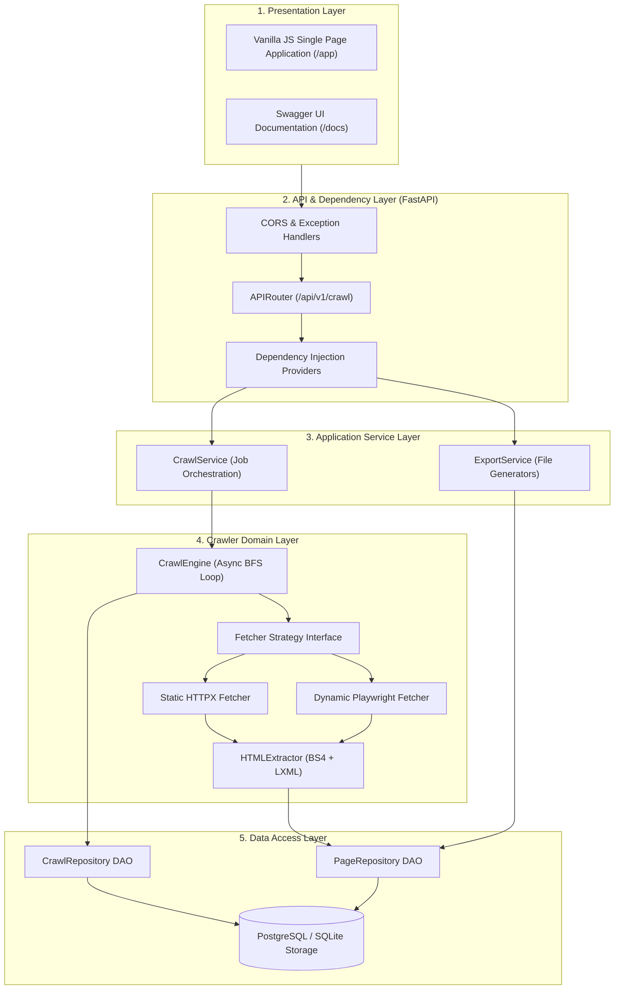
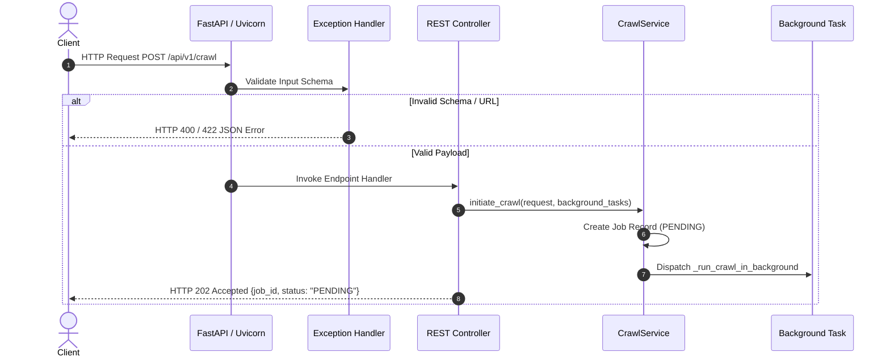
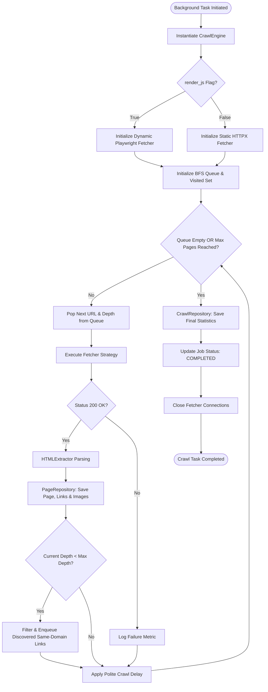
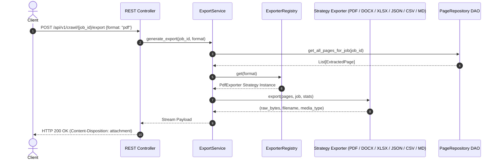

# Universal Website Data Extractor - System Architecture

This document provides a technical deep-dive into the architectural design, structural patterns, layer boundaries, and execution lifecycles of the **Universal Website Data Extractor**.

---

## 1. High-Level Architecture Overview

The system strictly adheres to **Clean Architecture** principles, ensuring that business domain logic (`crawler/`), data persistence (`db/`), and API controllers (`api/`) are completely decoupled.



---

## 2. Layer Responsibilities & Component Directory

```
src/
├── core/         # Core system settings, logging formatters, and domain exceptions.
├── db/           # Declarative ORM models (SQLAlchemy 2.0) and Repository DAOs.
├── utils/        # URL normalization, domain scoping, and validation functions.
├── schemas/      # Pydantic V2 data validation and response DTOs.
├── crawler/      # Crawler engine, static/dynamic fetcher strategies, and HTML parser.
├── application/  # High-level business use cases (CrawlService, ExportService).
└── api/          # FastAPI routes, dependency injection, and exception handlers.
```

### Architectural Layer Isolation Matrix

| Layer | Component | Dependencies | Responsibility |
| :--- | :--- | :--- | :--- |
| **Core** | `config.py`, `exceptions.py` | Pydantic Settings | System configurations & domain exception classes. |
| **Database** | `models/`, `repositories/` | SQLAlchemy Async | Persistent entity definitions and database CRUD queries. |
| **Utils** | `url_utils.py` | urllib.parse | Pure helper functions for URL validation and normalization. |
| **Domain** | `crawler/` | BS4, HTTPX, Playwright | Page fetching, HTML structural parsing, and BFS crawling logic. |
| **Application** | `services/` | Domain + DB DAOs | High-level orchestrators for background jobs and file exports. |
| **API Layer** | `endpoints/`, `main.py` | Application Services | HTTP request routing, input validation, and response delivery. |

---

## 3. Asynchronous Execution Lifecycles

### A. HTTP Request Processing Lifecycle



---

### B. Asynchronous Crawl Execution Lifecycle



---

### C. Data Export Lifecycle



---

## 4. Architectural Boundaries & System Trade-offs

1. **Async Concurrency vs Thread Pools**:
   - The application relies on native `asyncio` non-blocking I/O. Network-bound operations (fetching pages, executing SQL queries) yield control without blocking OS threads.
2. **Strategy Pattern Isolation**:
   - Decouples `StaticFetcher` (`httpx`) and `DynamicFetcher` (`playwright`) behind `BaseFetcher`. The `CrawlEngine` operates independently of which browser/client engine is active.
3. **Database Session Scoping**:
   - Background tasks create an isolated `AsyncSessionFactory()` instance rather than sharing request-scoped sessions, avoiding asynchronous session closure errors during long-running crawls.
