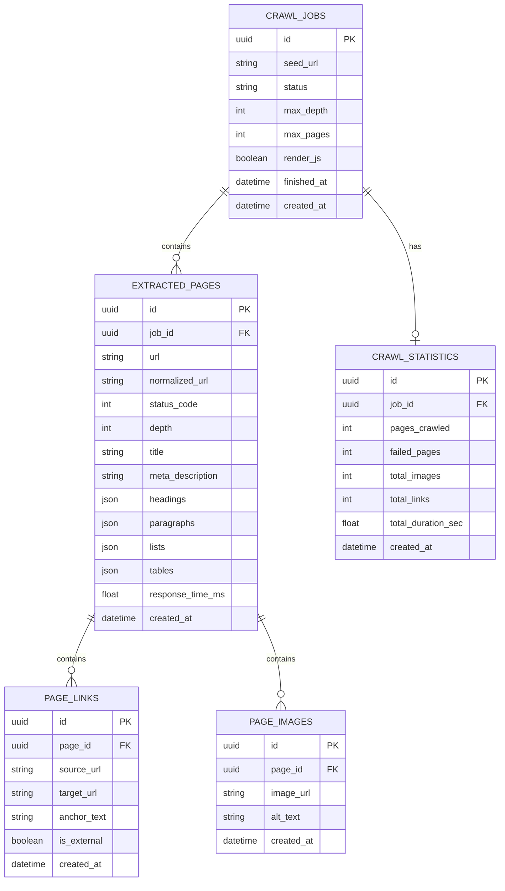

# Universal Website Data Extractor - Database Schema Reference

This document provides complete documentation for the relational database schema, ORM entity models, indexes, constraints, and data types used in the **Universal Website Data Extractor**.

---

## 1. Entity Relationship (ER) Diagram

---

## 2. Table Specifications

### 2.1 `crawl_jobs` Table
Stores crawl job lifecycle state, input seed target, and configuration parameters.

| Column | Type | Constraints | Default | Description |
| :--- | :--- | :--- | :--- | :--- |
| `id` | `UUID / CHAR(32)` | Primary Key, Indexed | `uuid4()` | Unique primary key. |
| `seed_url` | `VARCHAR(2048)` | Not Null, Indexed | — | Target seed URL. |
| `status` | `VARCHAR(9)` | Not Null, Indexed | `'PENDING'` | Lifecycle status (`PENDING`, `RUNNING`, `COMPLETED`, `FAILED`). |
| `max_depth` | `INTEGER` | Not Null | `2` | Max link traversal depth limit. |
| `max_pages` | `INTEGER` | Not Null | `50` | Max total unique pages limit. |
| `render_js` | `BOOLEAN` | Not Null | `false` | Playwright JS rendering toggle. |
| `finished_at` | `DATETIME` | Nullable | `null` | Job completion timestamp (UTC). |
| `created_at` | `DATETIME` | Not Null | `now()` | Job creation timestamp (UTC). |

---

### 2.2 `extracted_pages` Table
Stores parsed page metadata, structural HTML elements (headings, paragraphs, lists, tables), status codes, and latencies.

| Column | Type | Constraints | Default | Description |
| :--- | :--- | :--- | :--- | :--- |
| `id` | `UUID / CHAR(32)` | Primary Key, Indexed | `uuid4()` | Unique page primary key. |
| `job_id` | `UUID / CHAR(32)` | Foreign Key, Not Null, Indexed | — | Parent `crawl_jobs.id` (`ON DELETE CASCADE`). |
| `url` | `VARCHAR(2048)` | Not Null | — | Raw fetched page URL. |
| `normalized_url` | `VARCHAR(2048)` | Not Null, Indexed | — | Canonical normalized URL. |
| `status_code` | `INTEGER` | Not Null | `200` | HTTP response status code. |
| `depth` | `INTEGER` | Not Null | `0` | Traversal depth level. |
| `title` | `VARCHAR(1024)` | Nullable | `null` | Page `<title>` text. |
| `meta_description` | `TEXT` | Nullable | `null` | Meta description text content. |
| `headings` | `JSON / JSONB` | Not Null | `{}` | Headings dictionary (`h1`–`h6` arrays). |
| `paragraphs` | `JSON / JSONB` | Not Null | `[]` | Paragraph text array. |
| `lists` | `JSON / JSONB` | Not Null | `[]` | Ordered/Unordered lists array. |
| `tables` | `JSON / JSONB` | Not Null | `[]` | Parsed HTML data tables array. |
| `response_time_ms` | `FLOAT` | Not Null | `0.0` | HTTP response fetch latency (ms). |
| `created_at` | `DATETIME` | Not Null | `now()` | Extraction timestamp (UTC). |

---

### 2.3 `page_links` Table
Stores hyperlinked URLs discovered on extracted web pages.

| Column | Type | Constraints | Default | Description |
| :--- | :--- | :--- | :--- | :--- |
| `id` | `UUID / CHAR(32)` | Primary Key, Indexed | `uuid4()` | Unique primary key. |
| `page_id` | `UUID / CHAR(32)` | Foreign Key, Not Null, Indexed | — | Parent `extracted_pages.id` (`ON DELETE CASCADE`). |
| `source_url` | `VARCHAR(2048)` | Not Null | — | Originating page URL. |
| `target_url` | `VARCHAR(2048)` | Not Null, Indexed | — | Hyperlink target URL. |
| `anchor_text` | `TEXT` | Nullable | `null` | Clickable anchor text. |
| `is_external` | `BOOLEAN` | Not Null | `false` | True if link targets third-party domain. |
| `created_at` | `DATETIME` | Not Null | `now()` | Timestamp (UTC). |

---

### 2.4 `page_images` Table
Stores image URLs and `alt` text metadata extracted from `` elements.

| Column | Type | Constraints | Default | Description |
| :--- | :--- | :--- | :--- | :--- |
| `id` | `UUID / CHAR(32)` | Primary Key, Indexed | `uuid4()` | Unique primary key. |
| `page_id` | `UUID / CHAR(32)` | Foreign Key, Not Null, Indexed | — | Parent `extracted_pages.id` (`ON DELETE CASCADE`). |
| `image_url` | `VARCHAR(2048)` | Not Null | — | Absolute image source URL. |
| `alt_text` | `TEXT` | Nullable | `null` | Image alt attribute description. |
| `created_at` | `DATETIME` | Not Null | `now()` | Timestamp (UTC). |

---

### 2.5 `crawl_statistics` Table
Stores aggregate metrics and performance execution statistics for a crawl job.

| Column | Type | Constraints | Default | Description |
| :--- | :--- | :--- | :--- | :--- |
| `id` | `UUID / CHAR(32)` | Primary Key, Indexed | `uuid4()` | Unique primary key. |
| `job_id` | `UUID / CHAR(32)` | Foreign Key, Unique, Not Null, Indexed | — | Parent `crawl_jobs.id` (`ON DELETE CASCADE`). |
| `pages_crawled` | `INTEGER` | Not Null | `0` | Successful pages count. |
| `failed_pages` | `INTEGER` | Not Null | `0` | Failed HTTP pages count. |
| `total_images` | `INTEGER` | Not Null | `0` | Extracted images total. |
| `total_links` | `INTEGER` | Not Null | `0` | Discovered links total. |
| `total_duration_sec` | `FLOAT` | Not Null | `0.0` | Total job runtime (sec). |
| `created_at` | `DATETIME` | Not Null | `now()` | Statistics update timestamp (UTC). |

---

## 3. Database Design Rationale

1. **Relational Normalization & Cascading Deletes**:
   - `page_links` and `page_images` are stored as separate 1:N normalized child entities linked to `extracted_pages.id`.
   - All foreign keys define `ondelete="CASCADE"`, ensuring that deleting a `CrawlJob` automatically purges all child pages, links, images, and statistics without orphan records.

2. **JSON / JSONB Flexible Fields**:
   - Variable-length structural elements (`headings`, `paragraphs`, `lists`, `tables`) are stored as JSON/JSONB fields within `extracted_pages`. This avoids over-normalizing semi-structured HTML content into dozens of extra tables.

3. **Dual Engine Dialects**:
   - Built on SQLAlchemy 2.0 Async ORM. Supported dialects:
     - **PostgreSQL (`asyncpg`)**: Native UUIDs, JSONB, and connection pooling.
     - **SQLite (`aiosqlite`)**: Native fallback (`CHAR(32)` UUIDs, JSON) when `USE_SQLITE=true` is set.
